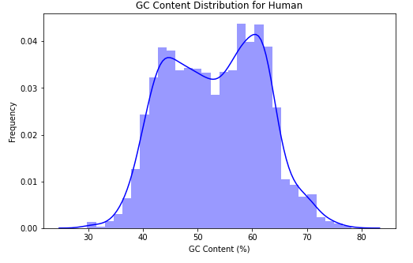
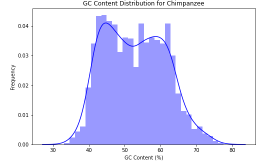
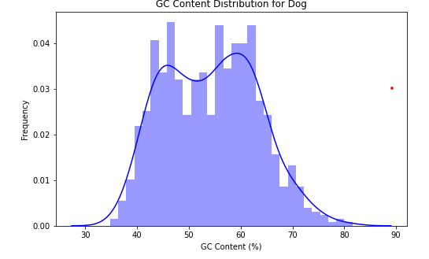

# DNA Sequence Analysis Using Machine Learning

This project explores the use of machine learning and deep learning techniques to classify DNA sequences and uncover evolutionary relationships between species. It was my **first project in bioinformatics**, and it helped me gain a foundational understanding of how to process biological sequences, extract meaningful features, and evaluate models on genomics data.

---

## Objectives

- Encode DNA sequences using k-mers and analyze nucleotide composition (e.g., GC content)
- Train machine learning models to classify sequences by species
- Visualize sequence distributions and alignments across humans, chimpanzees, and dogs
- Gain insights into cross-species genetic similarity using pairwise alignment and similarity heatmaps

---

## Data Preprocessing

- **Input**: Raw DNA sequences for Human, Chimpanzee, and Dog
- **K-mer extraction**: Transformed sequences into numerical features using 4-mer, 6-mer, and 8-mer patterns
- **GC content analysis**: Computed %GC for each sequence as a biologically relevant feature

---

## Feature Engineering & Modeling

- **Traditional ML models**:
  - Logistic Regression, Support Vector Machine (SVM), and Naive Bayes
- **Deep Learning model**:
  - LSTM to capture sequential dependencies in DNA sequences
- **Evaluation**:
  - Accuracy scores across species and k-mer sizes

### Sample Results

| Species     | K-mer | Logistic Regression | SVM  | LSTM |
|-------------|-------|---------------------|------|------|
| Human       | 6     | 0.935               | 0.884| 0.671|
| Chimpanzee  | 4     | 0.932               | 0.902| 0.677|
| Dog         | 4     | 0.762               | 0.744| 0.402|

> Logistic Regression and SVM consistently outperformed LSTM on this small dataset.

---

## Biological Insights

### GC Content Distribution

GC content was visualized across species to analyze nucleotide composition differences.

| Human | Chimpanzee | Dog |
|-------|------------|-----|
|  |  |  |

---

### Sequence Alignment

Pairwise alignment of DNA sequences between species was performed to highlight conserved regions.

> The alignment above reveals significant overlap in base pair patterns between human and chimpanzee DNA sequences (Alignment Score: 189).

---

### Cross-Species Similarity

A position-wise similarity heatmap was generated for each species pair:

- **Human vs. Chimpanzee**: Highest similarity
- **Human vs. Dog** and **Chimpanzee vs. Dog**: Lower similarity
- Reflects expected evolutionary distances

---

## Key Learnings & Reflections

- This project introduced me to **bioinformatics preprocessing**, **sequence encoding**, and **evolutionary insights**
- **Traditional models like Logistic Regression and SVM** performed best for this task
- **LSTM models struggled**, likely due to the small size and simplicity of the dataset
- **Biological visualization** (GC content, alignments) enriched model interpretation
- I became more comfortable with integrating ML techniques into biology-focused tasks

---

## Future Work

- Use real-world biological datasets (e.g., NCBI GenBank, Ensembl)
- Explore more complex architectures like Transformers (e.g., DNABERT)
- Perform multi-class classification on gene function or chromosomal origin
- Integrate biological databases and perform functional annotation of sequences

---

## 🛠️ Tech Stack

- **Python**, **Pandas**, **Scikit-learn**
- **Matplotlib**, **Seaborn** for visualization
- **TensorFlow/Keras** for LSTM modeling
- **BioPython** for sequence alignment

